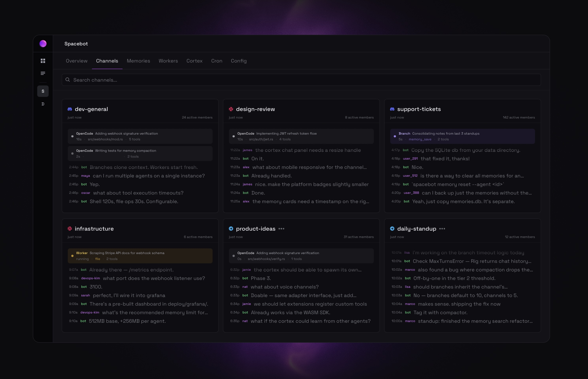

<p align="center">
  
</p>

<h1 align="center">Spacebot</h1>

<p align="center">
  <strong>An AI agent for teams, communities, and multi-user environments.</strong><br/>
  Thinks, executes, and responds — concurrently, not sequentially.<br/>
  Never blocks. Never forgets.
</p>

<p align="center">
  <a href="https://fsl.software/">
    
  </a>
  <a href="https://github.com/spacedriveapp/spacebot">
    
  </a>
  <a href="https://discord.gg/gTaF2Z44f5">
    
  </a>
</p>

<p align="center">
  <a href="https://spacebot.sh"><strong>spacebot.sh</strong></a> •
  <a href="#how-it-works">How It Works</a> •
  <a href="#architecture">Architecture</a> •
  <a href="#quick-start">Quick Start</a> •
  <a href="#tech-stack">Tech Stack</a> •
  <a href="https://docs.spacebot.sh">Docs</a>
</p>

> **One-click deploy with [spacebot.sh](https://spacebot.sh)** — connect your Discord, Slack, Telegram, or Twitch, configure your agent, and go. No self-hosting required.

<p align="center">
  
</p>

---

## The Problem

Most AI agent frameworks run everything in a single session. One LLM thread handles conversation, thinking, tool execution, memory retrieval, and context compaction — all in one loop. When it's doing work, it can't talk to you. When it's compacting, it goes dark. When it retrieves memories, raw results pollute the context with noise.

[OpenClaw](https://github.com/anomalyco/openclaw) _does_ have subagents, but handles them poorly and there's no enforcement to their use. The session is the bottleneck for everything.

Spacebot splits the monolith into specialized processes that only do one thing, and delegate everything else.

---

## Built for Teams and Communities

Most AI agents are built for one person in one conversation. Spacebot is built for many people working together — a Discord community with hundreds of active members, a Slack workspace with teams running parallel workstreams, a Telegram group coordinating across time zones.

This is why the architecture exists. A single-threaded agent breaks the moment two people talk at once. Spacebot's delegation model means it can think about User A's question, execute a task for User B, and respond to User C's small talk — all at the same time, without any of them waiting on each other.

**For communities** — drop Spacebot into a Discord server. It handles concurrent conversations across channels and threads, remembers context about every member, and does real work (code, research, file operations) without going dark. Fifty people can interact with it simultaneously.

**For fast-moving channels** — when messages are flying in, Spacebot doesn't try to respond to every single one. A message coalescing system detects rapid-fire bursts, batches them into a single turn, and lets the LLM read the room — it picks the most interesting thing to engage with, or stays quiet if there's nothing to add. Configurable debounce timing, automatic DM bypass, and the LLM always knows which messages arrived together.

**For teams** — connect it to Slack. Each channel gets a dedicated conversation with shared memory. Spacebot can run long coding sessions for one engineer while answering quick questions from another. Workers handle the heavy lifting in the background while the channel stays responsive.

**For multi-agent setups** — run multiple agents on one instance. A community bot with a friendly personality on Discord, a no-nonsense dev assistant on Slack, and a research agent handling background tasks. Each with its own identity, memory, and security permissions. One binary, one deploy.

### Deploy Your Way

| Method                                 | What You Get                                                                                |
| -------------------------------------- | ------------------------------------------------------------------------------------------- |
| **[spacebot.sh](https://spacebot.sh)** | One-click hosted deploy. Connect your platforms, configure your agent, done.                |
| **Self-hosted**                        | Single Rust binary. No Docker, no server dependencies, no microservices. Clone, build, run. |
| **Docker**                             | Container image with everything included. Mount a volume for persistent data.               |

---

## Capabilities

### Task Execution

Workers come loaded with tools for real work:

- **Shell** — run arbitrary commands with configurable timeouts
- **File** — read, write, and list files with auto-created directories
- **Exec** — run specific programs with arguments and environment variables
- **[OpenCode](https://opencode.ai)** — spawn a full coding agent as a persistent worker with codebase exploration, LSP awareness, and deep context management
- **Browser** — headless Chrome automation with an accessibility-tree ref system. Navigate, click, type, screenshot, manage tabs — the LLM addresses elements by short refs (`e0`, `e1`) instead of fragile CSS selectors
- **[Brave](https://brave.com/search/api/) web search** — search the web with freshness filters, localization, and configurable result count

### Messaging

Native adapters for Discord, Slack, Telegram, Twitch, and Webchat with full platform feature support:

- **Message coalescing** — rapid-fire messages are batched into a single LLM turn with timing context, so the agent reads the room instead of spamming replies
- **File attachments** — send and receive files, images, and documents
- **Rich messages** — embeds/cards, interactive buttons, select menus, and polls (Discord). Block Kit messages and slash commands (Slack)
- **Threading** — automatic thread creation for long conversations
- **Reactions** — emoji reactions on messages
- **Typing indicators** — visual feedback while the agent is thinking
- **Message history backfill** — reads recent conversation context on first message
- **Per-channel permissions** — guild, channel, and DM-level access control, hot-reloadable
- **Webchat** — embeddable portal chat with SSE streaming, per-agent session isolation

### Memory

Not markdown files. Not _unstructured_ blocks in a vector database. Spacebot's memory is a typed, graph-connected knowledge system — and this opinionated structure is why agents are productive out of the box.

Every memory has a type, an importance score, and graph edges connecting it to related memories. The agent doesn't just "remember things" — it knows the difference between a fact it learned, a decision that was made, a goal it's working toward, and a preference the user expressed. This structure is what lets the cortex synthesize a useful briefing instead of dumping raw search results into context.

- **Eight memory types** — Fact, Preference, Decision, Identity, Event, Observation, Goal, Todo
- **Graph edges** — RelatedTo, Updates, Contradicts, CausedBy, PartOf
- **Hybrid recall** — vector similarity + full-text search merged via Reciprocal Rank Fusion
- **Memory import** — dump files into the `ingest/` folder and Spacebot extracts structured memories automatically. Supports text, markdown, and PDF files. Migrating from OpenClaw? Drop your markdown memory files in and walk away.
- **Cross-channel recall** — branches can read transcripts from other conversations
- **Memory bulletin** — the cortex generates a periodic briefing of the agent's knowledge, injected into every conversation

### Scheduling

Cron jobs created and managed from conversation or config:

- **Natural scheduling** — "check my inbox every 30 minutes" becomes a cron job with a delivery target
- **Clock-aligned intervals** — sub-daily intervals snap to UTC boundaries so jobs fire on clean marks (e.g. every 30 min fires at :00 and :30)
- **Configurable timeouts** — per-job `timeout_secs` to cap execution time (defaults to 120s)
- **Active hours** — restrict jobs to specific time windows (supports midnight wrapping)
- **Circuit breaker** — auto-disables after 3 consecutive failures
- **Full agent capabilities** — each job gets a fresh channel with branching and workers

### Model Routing

Four-level routing system that picks the right model for every LLM call. Structural routing handles the common case — process types and task types are known at spawn time. Prompt-level routing handles the rest, scoring user messages to downgrade simple requests to cheaper models automatically.

- **Process-type defaults** — channels get the best conversational model, workers get something fast and cheap, compactors get the cheapest tier
- **Task-type overrides** — a coding worker upgrades to a stronger model, a summarization worker stays cheap
- **Prompt complexity scoring** — lightweight keyword scorer classifies user messages into three tiers (light/standard/heavy) and routes to the cheapest model that can handle it. Scores the user message only — system prompts and context are excluded. <1ms, no external calls
- **Fallback chains** — when a model returns 429 or 502, the next model in the chain takes over automatically
- **Rate limit tracking** — 429'd models are deprioritized across all agents for a configurable cooldown
- **Per-agent routing profiles** — eco, balanced, or premium presets that shift what models each tier maps to. A budget agent routes simple messages to free models while a premium agent stays on opus

```toml
[defaults.routing]
channel = "anthropic/claude-sonnet-4"
worker = "anthropic/claude-haiku-4.5"

[defaults.routing.task_overrides]
coding = "anthropic/claude-sonnet-4"

[defaults.routing.prompt_routing]
enabled = true
process_types = ["channel", "branch"]

[defaults.routing.fallbacks]
"anthropic/claude-sonnet-4" = ["anthropic/claude-haiku-4.5"]
```

**Z.ai (GLM) example** — use GLM models directly with a [GLM Coding Plan](https://z.ai) subscription:

```toml
[llm]
zhipu_key = "env:ZHIPU_API_KEY"

[defaults.routing]
channel = "zhipu/glm-4.7"
worker = "zhipu/glm-4.7"

[defaults.routing.task_overrides]
coding = "zhipu/glm-4.7"
```

**Ollama example** — run against a local Ollama instance:

```toml
[llm]
ollama_base_url = "http://localhost:11434"

[defaults.routing]
channel = "ollama/gemma3"
worker = "ollama/gemma3"

[defaults.routing.task_overrides]
coding = "ollama/qwen3"
```

**Custom provider example** — add any OpenAI-compatible or Anthropic-compatible endpoint:

```toml
[llm.provider.my-provider]
api_type = "openai_completions"  # or "anthropic"
base_url = "https://my-llm-host.example.com"
api_key = "env:MY_PROVIDER_KEY"

[defaults.routing]
channel = "my-provider/my-model"
```

Additional built-in providers include **NVIDIA**, **MiniMax**, **Moonshot AI (Kimi)**, and **Z.AI Coding Plan** — configure with `nvidia_key`, `minimax_key`, `moonshot_key`, or `zai_coding_plan_key` in `[llm]`.

### Skills

Extensible skill system integrated with [skills.sh](https://skills.sh):

- **skills.sh registry** — install any skill from the public ecosystem with one command
- **CLI management** — `spacebot skill add owner/repo` to install, list, remove, and inspect skills
- **Worker injection** — skills are injected into worker system prompts for specialized tasks
- **Bundled resources** — scripts, references, and assets packaged with skills
- **OpenClaw compatible** — drop in existing OpenClaw skills, or any skill from skills.sh

**Install skills from the registry:**

```bash
spacebot skill add vercel-labs/agent-skills
spacebot skill add anthropics/skills/pdf
spacebot skill list
```

### MCP Integration

Connect workers to external [MCP](https://modelcontextprotocol.io/) (Model Context Protocol) servers for arbitrary tool access -- databases, APIs, SaaS products, custom integrations -- without native Rust implementations:

- **Per-agent config** — each agent declares its own MCP servers in `config.toml`
- **Both transports** — stdio (subprocess) for local tools, streamable HTTP for remote servers
- **Automatic tool discovery** — tools are discovered via the MCP protocol and registered on worker ToolServers with namespaced names (`{server}_{tool}`)
- **Automatic retry** — failed connections retry in the background with exponential backoff (5s initial, 60s cap, 12 attempts). A broken server never blocks agent startup
- **Hot-reloadable** — add, remove, or change servers in config and they reconcile live
- **API management** — full CRUD API under `/api/mcp/` for managing server definitions and monitoring connection status programmatically

```toml
[[mcp_servers]]
name = "filesystem"
transport = "stdio"
command = "npx"
args = ["-y", "@modelcontextprotocol/server-filesystem", "/workspace"]

[[mcp_servers]]
name = "sentry"
transport = "http"
url = "https://mcp.sentry.io"
headers = { Authorization = "Bearer ${SENTRY_TOKEN}" }
```

---

## How It Works

Five process types. Each does one job.

### Channels

The user-facing LLM process — the ambassador to the human. One per conversation (Discord thread, Slack channel, Telegram DM, etc). Has soul, identity, and personality. Talks to the user. Delegates everything else.

A channel does **not**: execute tasks directly, search memories itself, or do any heavy tool work. It is always responsive — never blocked by work, never frozen by compaction.

When it needs to think, it branches. When it needs work done, it spawns a worker.

### Branches

A fork of the channel's context that goes off to think. Has the channel's full conversation history — same context, same memories, same understanding. Operates independently. The channel never sees the working, only the conclusion.

```
User A: "what do you know about X?"
    → Channel branches (branch-1)

User B: "hey, how's it going?"
    → Channel responds directly: "Going well! Working on something for A."

Branch-1 resolves: "Here's what I found about X: [curated memories]"
    → Channel sees the branch result on its next turn
    → Channel responds to User A with the findings
```

Multiple branches run concurrently. First done, first incorporated. Each branch forks from the channel's context at creation time, like a git branch.

### Workers

Independent processes that do jobs. Get a specific task, a focused system prompt, and task-appropriate tools. No channel context, no soul, no personality.

**Fire-and-forget** — do a job and return a result. Summarization, file operations, one-shot tasks.

**Interactive** — long-running, accept follow-up input from the channel. Coding sessions, multi-step tasks.

```
User: "refactor the auth module"
    → Branch spawns interactive coding worker
    → Branch returns: "Started a coding session for the auth refactor"

User: "actually, update the tests too"
    → Channel routes message to active worker
    → Worker receives follow-up, continues with its existing context
```

Workers are pluggable. Any process that accepts a task and reports status can be a worker.

**Built-in workers** come with shell, file, exec, and browser tools out of the box. They can write code, run commands, manage files, browse the web — enough to build a whole project from scratch.

**[OpenCode](https://opencode.ai) workers** are a built-in integration that spawns a full OpenCode coding agent as a persistent subprocess. OpenCode brings its own codebase exploration, LSP awareness, and context management — purpose-built for deep coding sessions. When a user asks for a complex refactor or a new feature, the channel can spawn an OpenCode worker that maintains a rich understanding of the codebase across the entire session. Both built-in and OpenCode workers support interactive follow-ups.

### The Compactor

Not an LLM process. A programmatic monitor per channel that watches context size and triggers compaction before the channel fills up.

| Threshold | Action                                       |
| --------- | -------------------------------------------- |
| **>80%**  | Background compaction (summarize oldest 30%) |
| **>85%**  | Aggressive compaction (summarize oldest 50%) |
| **>95%**  | Emergency truncation (hard drop, no LLM)     |

Compaction workers run alongside the channel without blocking it. Summaries stack chronologically at the top of the context window.

### The Cortex

The agent's inner monologue. The only process that sees across all channels, workers, and branches simultaneously. Generates a **memory bulletin** — a periodically refreshed, LLM-curated briefing of the agent's knowledge injected into every conversation. Supervises running processes (kills hanging workers, cleans up stale branches). Maintains the memory graph (decay, pruning, merging near-duplicates, cross-channel consolidation). Detects patterns across conversations and creates observations. Also provides a direct interactive admin chat with full tool access for system inspection and manual intervention.

---

## Architecture

```
User sends message
    → Channel receives it
        → Branches to think (has channel's context)
            → Branch recalls memories, decides what to do
            → Branch might spawn a worker for heavy tasks
            → Branch returns conclusion
        → Branch deleted
    → Channel responds to user

Channel context hits 80%
    → Compactor notices
        → Spins off a compaction worker
            → Worker summarizes old context + extracts memories
            → Compacted summary swaps in
    → Channel never interrupted
```

### What Each Process Gets

| Process   | Type               | Tools                                     | Context                             |
| --------- | ------------------ | ----------------------------------------- | ----------------------------------- |
| Channel   | LLM                | Reply, branch, spawn workers, route       | Conversation + compaction summaries |
| Branch    | LLM                | Memory recall, memory save, spawn workers | Fork of channel's context           |
| Worker    | Pluggable          | Shell, file, exec, browser (configurable) | Fresh prompt + task description     |
| Compactor | Programmatic       | Monitor context, trigger workers          | N/A                                 |
| Cortex    | LLM + Programmatic | Memory, consolidation, system monitor     | Entire agent scope                  |

### Memory System

Memories are structured objects, not files. Every memory is a row in SQLite with typed metadata and graph connections, paired with a vector embedding in LanceDB.

- **Eight types** — Fact, Preference, Decision, Identity, Event, Observation, Goal, Todo
- **Graph edges** — RelatedTo, Updates, Contradicts, CausedBy, PartOf
- **Hybrid search** — Vector similarity + full-text search, merged via Reciprocal Rank Fusion
- **Three creation paths** — Branch-initiated, compactor-initiated, cortex-initiated
- **Importance scoring** — Access frequency, recency, graph centrality. Identity memories exempt from decay.

### Cron Jobs

Scheduled recurring tasks. Each cron job gets a fresh short-lived channel with full branching and worker capabilities.

- Multiple cron jobs run independently at different intervals
- Stored in the database, created via config, conversation, or programmatically
- Clock-aligned intervals snap to UTC boundaries for predictable firing times
- Per-job `timeout_secs` to cap execution time
- Circuit breaker auto-disables after 3 consecutive failures
- Active hours support with midnight wrapping

### Multi-Agent

Each agent is an independent entity with its own workspace, databases, identity files, cortex, and messaging bindings. All agents share one binary, one tokio runtime, and one set of API keys.

---

### Spacedrive Integration (Future)

Spacebot is the AI counterpart to [Spacedrive](https://github.com/spacedriveapp/spacedrive) — an open source cross-platform file manager built on a virtual distributed filesystem. Both projects are independent and fully functional on their own, but complementary by design. Spacedrive indexes files across all your devices, clouds, and platforms with content-addressed identity, semantic search, and local AI analysis. Spacebot brings autonomous reasoning, memory, and task execution. Together, an agent that can think, remember, and act — backed by terabytes of queryable data across every device you own.

Read the full vision in the [roadmap](docs/content/docs/(deployment)/roadmap.mdx).

---

## Quick Start

### Prerequisites

- **Rust** 1.85+ ([rustup](https://rustup.rs/))
- An LLM API key from any supported provider (Anthropic, OpenAI, OpenRouter, Z.ai, Groq, Together, Fireworks, DeepSeek, xAI, Mistral, NVIDIA, MiniMax, Moonshot AI, OpenCode Zen) — or use `spacebot auth login` for Anthropic OAuth

### Build and Run

```bash
git clone https://github.com/spacedriveapp/spacebot
cd spacebot
cargo build --release
```

### Minimal Config

Create `config.toml`:

```toml
[llm]
openrouter_key = "env:OPENROUTER_API_KEY"

[defaults.routing]
channel = "anthropic/claude-sonnet-4"
worker = "anthropic/claude-sonnet-4"

[[agents]]
id = "my-agent"

[messaging.discord]
token = "env:DISCORD_BOT_TOKEN"

[[bindings]]
agent_id = "my-agent"
channel = "discord"
guild_id = "your-discord-guild-id"
```

```bash
spacebot                      # start as background daemon
spacebot start --foreground   # or run in the foreground
spacebot stop                 # graceful shutdown
spacebot restart              # stop + start
spacebot status               # show pid and uptime
spacebot auth login           # authenticate via Anthropic OAuth
```

The binary creates all databases and directories automatically on first run. See the [quickstart guide](docs/content/docs/(getting-started)/quickstart.mdx) for more detail.

### Authentication

Spacebot supports Anthropic OAuth as an alternative to static API keys. Use your Claude Pro, Max, or API Console subscription directly:

```bash
spacebot auth login             # OAuth via Claude Pro/Max (opens browser)
spacebot auth login --console   # OAuth via API Console
spacebot auth status            # show credential status and expiry
spacebot auth refresh           # manually refresh the access token
spacebot auth logout            # remove stored credentials
```

OAuth tokens are stored in `anthropic_oauth.json` and auto-refresh transparently before each API call. When OAuth credentials are present, they take priority over a static `ANTHROPIC_API_KEY`.

---

## Tech Stack

| Layer           | Technology                                                                                                      |
| --------------- | --------------------------------------------------------------------------------------------------------------- |
| Language        | **Rust** (edition 2024)                                                                                         |
| Async runtime   | **Tokio**                                                                                                       |
| LLM framework   | **[Rig](https://github.com/0xPlaygrounds/rig)** v0.30 — agentic loop, tool execution, hooks                     |
| Relational data | **SQLite** (sqlx) — conversations, memory graph, cron jobs                                                      |
| Vector + FTS    | **[LanceDB](https://lancedb.github.io/lancedb/)** — embeddings (HNSW), full-text (Tantivy), hybrid search (RRF) |
| Key-value       | **[redb](https://github.com/cberner/redb)** — settings, encrypted secrets                                       |
| Embeddings      | **FastEmbed** — local embedding generation                                                                      |
| Crypto          | **AES-256-GCM** — secret encryption at rest                                                                     |
| Discord         | **Serenity** — gateway, cache, events, rich messages, interactions                              |
| Slack           | **slack-morphism** — Socket Mode, events, Block Kit, slash commands, streaming via message edits |
| Telegram        | **teloxide** — long-poll, media attachments, group/DM support                                   |
| Twitch          | **twitch-irc** — chat integration with trigger prefix                                           |
| Browser         | **Chromiumoxide** — headless Chrome via CDP                                                     |
| CLI             | **Clap** — command line interface                                                                               |

No server dependencies. Single binary. All data lives in embedded databases in a local directory.

---

## Documentation

| Doc                                    | Description                                              |
| -------------------------------------- | -------------------------------------------------------- |
| [Quick Start](docs/content/docs/(getting-started)/quickstart.mdx) | Setup, config, first run                                 |
| [Config Reference](docs/content/docs/(configuration)/config.mdx) | Full `config.toml` reference                             |
| [Agents](docs/content/docs/(core)/agents.mdx)                    | Multi-agent setup and isolation                          |
| [Memory](docs/content/docs/(core)/memory.mdx)                    | Memory system design                                     |
| [Tools](docs/content/docs/(features)/tools.mdx)                  | All available LLM tools                                  |
| [Compaction](docs/content/docs/(core)/compaction.mdx)            | Context window management                                |
| [Cortex](docs/content/docs/(core)/cortex.mdx)                    | Memory bulletin and system observation                   |
| [Cron Jobs](docs/content/docs/(features)/cron.mdx)               | Scheduled recurring tasks                                |
| [Routing](docs/content/docs/(core)/routing.mdx)                  | Model routing and fallback chains                        |
| [Messaging](docs/content/docs/(messaging)/messaging.mdx)         | Adapter architecture (Discord, Slack, Telegram, Twitch, Webchat, webhook) |
| [Discord Setup](docs/content/docs/(messaging)/discord-setup.mdx) | Discord bot setup guide                                  |
| [Browser](docs/content/docs/(features)/browser.mdx)              | Headless Chrome for workers                              |
| [MCP](docs/content/docs/(features)/mcp.mdx)                      | External tool servers via Model Context Protocol         |
| [OpenCode](docs/content/docs/(features)/opencode.mdx)            | OpenCode as a worker backend                             |
| [Philosophy](docs/content/docs/(core)/philosophy.mdx)            | Why Rust                                                 |

---

## Why Rust

Spacebot isn't a chatbot — it's an orchestration layer for autonomous AI processes running concurrently, sharing memory, and delegating to each other. That's infrastructure, and infrastructure should be machine code.

Rust's strict type system and compiler mean there's one correct way to express something. When multiple AI processes share mutable state and spawn tasks without human oversight, "the compiler won't let you do that" is a feature. The result is a single binary with no runtime dependencies, no garbage collector pauses, and predictable resource usage.

Read the full argument in [docs/philosophy](docs/content/docs/(core)/philosophy.mdx).

---

## Contributing

Contributions welcome. Read [RUST_STYLE_GUIDE.md](RUST_STYLE_GUIDE.md) before writing any code, and [AGENTS.md](AGENTS.md) for the full implementation guide.

1. Fork the repo
2. Create a feature branch
3. Run `./scripts/install-git-hooks.sh` once (installs pre-commit formatting hook)
4. Make your changes
5. Submit a PR

Formatting is still enforced in CI, but the hook catches it earlier by running `cargo fmt --all` before each commit.

---

## License

FSL-1.1-ALv2 — [Functional Source License](https://fsl.software/), converting to Apache 2.0 after two years. See [LICENSE](LICENSE) for details.
